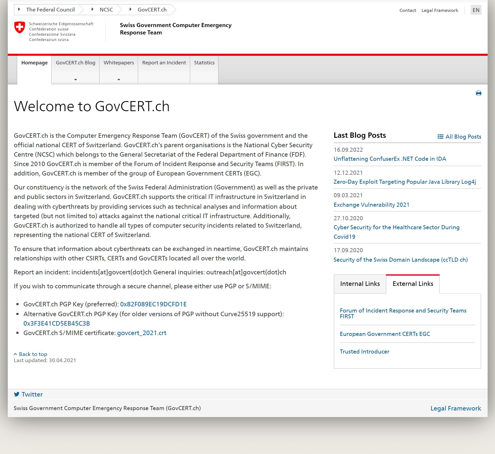
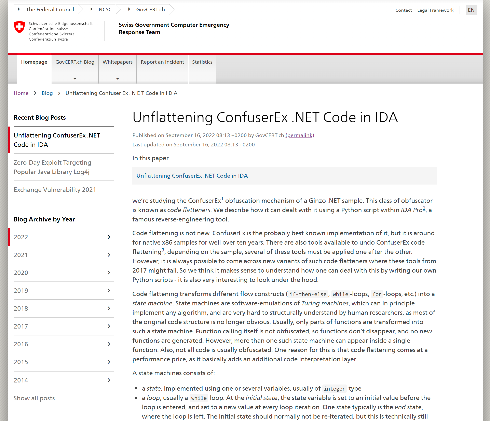
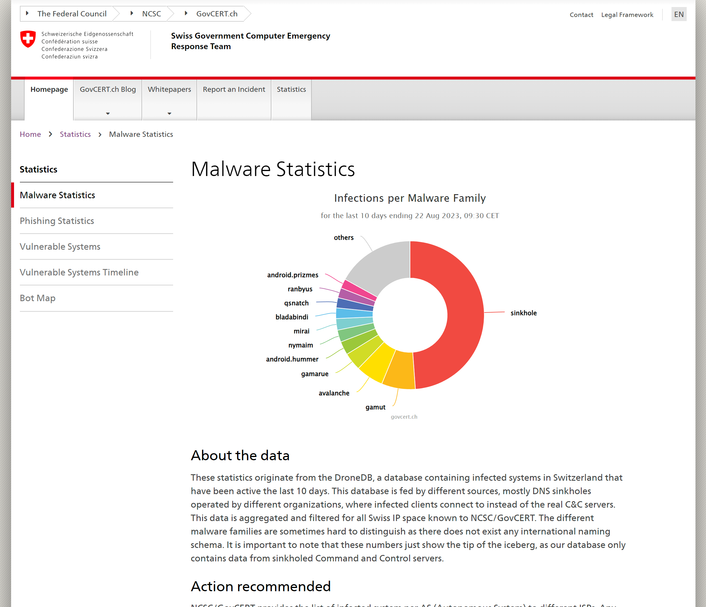

# GovCERT.ch Website

This repository contains the source files for the GovCERT.ch website as of 2023-09-01. The website is built using [hugo](https://gohugo.io/), a static site generator. The design uses the [Swiss Confederation Web Guidelines](https://github.com/swiss/styleguide).

Please note that this repository is no longer actively maintained and only serves as an archive, providing continued access to the content that was once hosted on [govcert.ch](https://www.govcert.ch).

Inside this repository you find all blog posts in Markdown format in the ``content\blog`` folder. Additionally, whitepapers and their corresponding summaries are available in the ``content\downloads\whitepapers`` and ``content\whitepapers`` folders, respectively.

You can recreate the entire website using the Hugo static site generator by running the ``hugo`` command inside root folder. The resulting website will be available in the ``public`` folder.


## Screenshots







## Building the Site 
You need to install [Hugo](https://gohugo.io/installation/) to build the site. There is no need to install the dependencies in `package.json` unless you want to modify the design or layout of the website.

```bash
git clone https://github.com/govcert/website.git
cd website 
hugo
```

## Creating new Content

**Important!**: Only edit or create files in ``content`` or ``data``. Do not touch ``themes``, it should only be modified by when changing the theme, (see below)[#tood]. Never edit files in ``public``, those will be overwritten by the hugo build process and scripts that write the statistics data.

Depending on what type of content you like to edit or create, you need to follow different procedures.

The GovCERT blog uses three content types:

- ``blog`` for blogposts
- ``whitepapers`` for whitepapers
- ``statistics`` for statistics

All content for these three types are stored in individual files. See the Sections below on how to edit them.

Editing other content, i.e., the "Homepage" or "Report an Incident" works as follows:

- To edit the **homepage**, edit the file ``content/_index.md``. The latest publications sidebar is created automatically. The links sidebar is edited differently, see next item.
- To edit the **links sidebar** on the homepage, edit the json file in ``data/sidebars.json``. 
- To edit the **Report an Incident** page (including sidebars), edit the file ``content/report.html``

### Blog Posts
Blogposts are stored in subfolders of ``content/blog/``. 

#### Editing Blog Posts
You can freely change the content of blogposts. If you make changes, manually set the ``lastmod`` front matter to the date of the modifications.

**EXCEPTION**: Changing the **Title** of a blog post breaks the link! If you want to change the title, you have two possibilities:

1. Add a ``slug`` frontmatter which you set to the slug of the post before editing. For example, if you change the title from ``A Nice Blog Post`` with link ``a-nice-blog-post``, then add ``slug: a-nice-blog-post``. Result: the blog post is still using the old link.
2. Add an ``aliases`` entry to the frontmatter. For example:
    ```
    aliases: 
    - a-nice-blog-post 
    ```
    The primary link for the blog post then reflects the changed title, but hugo also creates a redirect for the old one.


#### Creating Blog Posts
To create a new blog post, run the following command inside the root directory:
```
./hugo new blog/<slug>
```
where ``slug`` is the title of your post in all lowercase, with spaces replaced by ``-``. For example, for ``A Test Blog Post`` run:
```
./hugo new blog/a-test-blog-post
```
When you then run 

```bash
hugo serve
``` 
you should see the website at [http://localhost:1313/](http://localhost:1313/) and your blog post at the top of the sidebar on the right. 

The post is populated with content describing best practices, e.g., how to add images. To edit the blog post, open the ``post.md`` markdown file inside your blog subfolder, .e.g.:
```
vi content/blog/a-test-blog-post/post.md
```

### Whitepapers

Create a new whitepaper with
```
./hugo new whitepapers/<slug>.md
```

For example:

```
./hugo new whitepapers/this-is-cool.md
```

Fill out the frontmatter, and place the whitepaper in ``content/downloads/whitepapers`` (make sure the name matches the name in the frontmatter).


### Statistics
Copy a markdown file in ``statistics`` and a corresponding subfolder. The frontmatter ``js`` specifies the highcharts js that should be loaded (and in what order), for example ``js: [highmaps,data,exporting,switzerland]``. The file ``data.js`` should be overwritten by external scripts and deliver the data, the ``chart.js`` is the highchart file referencing the data.


### Requirements


You need to install [Hugo](https://gohugo.io/installation/) to build the site. There is no need to install the dependencies in `package.json` unless you want to modify the design or layout of the website.


## Modifying the theme

Install hugo https://gohugo.io/installation/

1. Download and install the latest version of [node](https://nodejs.org/en/download).
2. Run ``npm install`` from the root direcotry. It will install all dependencies used to generate the resources. Among them ``swiss-styleguide``, which is the official ``CD Bund`` template. All dependencies are fixed to compatible releases. Be careful, when updating to newer major releases.
4. Install gulp ``sudo npm install --global gulp-cli``
5. Build the website with ``gulp`` from the root directory. That builds the website and starts a development server to preview the website. Alternatively run ``gulp build`` to just build theme without previewing it.
6. If you are finished, run ``gulp build`` and commit all changed files.

### Updating 
To update JQuery or other dependencies, use the ``package.json``. 

In general:
- run ``npm outdated`` to see which packages can be updated. Be careful about major version jumps, for instance to to upgrade from Bootstrap 3 to 4 or 5.
- use ``npm audit`` to see vulnerabilities, and try ``npm audit fix`` to fix them.
- do not bother with devDependencies like ``gulp``. These are just used to build the static site and any vulnerabilities do not matter.
- run ``npm update`` to update packages, or manually change the version info in ``package.json``

If you want to update a JS library without installing node and all dependencies, you could also:

1. Just clone the repo
2. Change the JS in ``themes/govcert-ch/static/assets/js``. Make sure to adjust all links to the js library as well by grepping for the name.
3. Adjust the version number in ``package.json``.

## Design Choices

- The hugo theme ``govcert-ch`` was built from scratch and should have very minimal bloat.
- Config files are written in YAML, not the hugo default ``TOML``.
- Each file from the ``swiss-styleguide`` is copied only if really needed.
- Tries to keep the custom CSS to a minimum
- Tries to keep the gulp processing to a minimum (no SASS, Slim, Babel etc.)

## Licence

The website is released under the [MIT License](LICENSE.md).