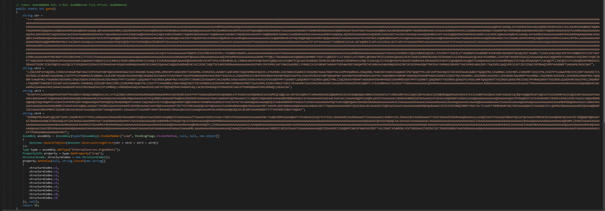
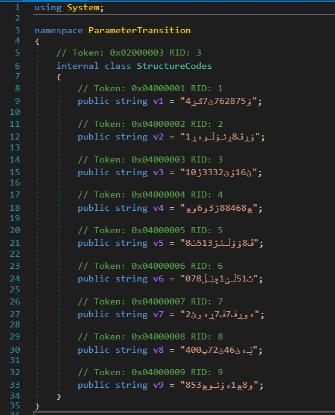
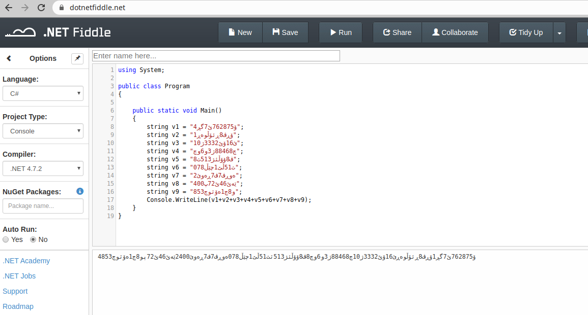
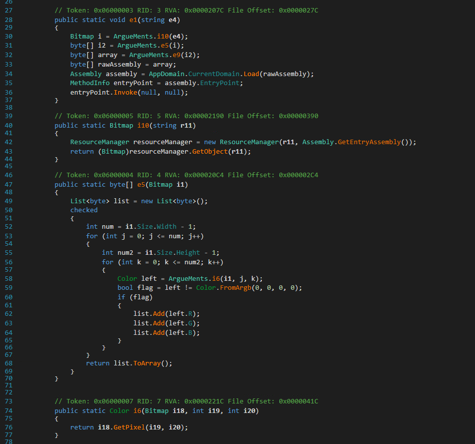
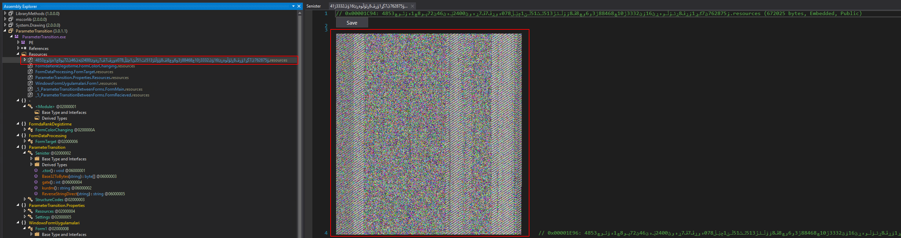
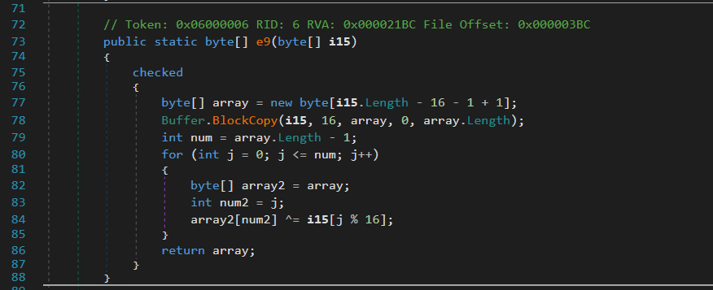

## Introduction

Currently, we are observing HawkEye samples being distributed by large malspam waves. HawkEye[^1] is a keylogger which has been around quite a long time (since 2013) and has evolved since then and gained more functionality. There are several good blog posts about HawkEye in general [^8] [^9]. Recently we observed an interesting obfuscation method in a HawkEye binary [^2], which we are going to describe in this blog post.

## Extracting Base32 encoded DLL

HawkEye is written in .NET and thus we can analyze it rather easily with the help of *dnSpy* [^3].

Looking through the decompiled source code in *dnSpy* we find the method `gate` in the class `Sinister`.

[](assets/01_base32_dll.png)

The Base32[^4] encoded strings are concatenated, then reversed and decoded. The output of the decoded string is a DLL written in .NET as well.
We can easily decode the string using `rev` and `base32` on a Linux system or with the help of similar tools.

After decoding, the DLL is loaded and the property `iraq` is set via reflection [^5]. This value is a concatenated string consisting of the following nine static strings.



*Side note: The concatenated string used here is encoded with non-latin letters (maybe Farsi, any feedback most welcome).  Trying to concatenate the strings in a text editor did not really work, however, using [dotnetfiddle.net](https://dotnetfiddle.net/) revealed the correct string.*
*Update: According to our colleagues at FedPol/BKP the string is actually Urdu. Thanks for the hint, most appreciated.*

[](assets/03_dotnet_fiddle.png))

## Extracting EXE file from embedded PNG

After opening the DLL in `dnspy`, we can examine the `set_iraq` method. The only thing this method does is to pass the argument to the method `ArgueMents.e1`.

The method `e1` loads and starts another executable file (lines 34--36). In order to analyze this executable, we need to know how it is loaded into the `rawAssembly` array and how we can extract it.

[](assets/04_image_loop.png)

Line 30 instantiates a `Bitmap` object with the value that was passed to the `set_iraq` method. Looking at the code of the method `i10` we see, that the image is loaded from the `ResourceManager` of the main binary. The bitmap is a PNG file, located in the resource  section of the main executable.

[](assets/05_encrypted_image.png)

Next, the `Bitmap` is passed to the method `e5`. This method reads the width and the height of the PNG. It then loops over the height (inner loop) and the width (outer loop) and stores the red, green and blue value of every pixel into a array and returns it. The alpha values as well as all pixels that are
`r,g,b,a = (0,0,0,0)` are omitted.

The resulting array is then passed to the decryption method `e9`.

[](assets/06_array_decrypt.png)

In this method, a new array is created which is 16 bytes smaller than the array containing the color values. Then, the image array is copied to the new array (the first 16 bytes are omitted).
The first 16 bytes are in fact the key needed to decrypt the rest of the data using `XOR`.
There is a `for` loop, which will iterate over every value in the smaller array and XORs the value with the corresponding value of the key.

The decoded data is a PE file (exe), which is loaded into the memory. Finally the `EntryPoint` of the File is called.

As the key is stored in the Image itself, we can write a small python script to decrypt this and similar images.

```python
#!/usr/bin/python3
from PIL import Image
import argparse

KEY_LENGTH = 16


def get_color_values(file_name):
    arr = bytearray()
    im = Image.open(file_name)
    w, h = im.size
    for i in range(w):
        for j in range(h):
            r, g, b, t = im.getpixel((i, j))
            # ignore zero values
            if (r, g, b, t) != (0, 0, 0, 0):
                arr.extend([r, g, b])
    return arr


def process(input_file, output_file):
    arr = get_color_values(input_file)
    key = arr[:KEY_LENGTH]
    data = arr[KEY_LENGTH:]

    for i in range(len(data)):
        data[i] ^= key[i % KEY_LENGTH]

    with open(output_file, "wb") as o:
        o.write(data)

if __name__ == "__main__":
    parser = argparse.ArgumentParser()
    parser.add_argument("input_file")
    parser.add_argument("output_file")
    args = parser.parse_args()
    process(args.input_file, args.output_file)

```

In this case, the resulting PE file is once again heavily obfuscated, the first stage is obfuscated with *Babel Obfuscator* [^6]. The final payload after several obfuscation rounds is HawkEye.

## Conclusion

The obfuscation technique using a PNG file to store a PE file is neither new, nor very advanced. However we found it to be noteworthy nevertheless as we do not see it often. It could be an interesting way to bypass anti virus products, because the PE file is loaded directly into the memory, however in this case, the resulting HawkEye binary stores a copy of itself on the disk after the infection and therefore may be detected by AV products.

The detection rate of VirusTotal shows, that the "smuggling" technique is actually working. The initial malicious file [^2] is detected by only 17 AV engines (two weeks after the first upload). The decrypted PE file[^7] was detected by 34 engines right after upload.


[^1]: [Malpedia page of HawkEye](https://malpedia.caad.fkie.fraunhofer.de/details/win.hawkeye_keylogger)
[^2]: [HawkEye sample analysed in this blog post](https://www.virustotal.com/gui/file/c3aee0c6d519231df8373947ad1e6b626838765f00dae0717943dbfe599b41a8/detection)
[^3]: [dnSpy](https://github.com/0xd4d/dnSpy)
[^4]: [Base32](https://tools.ietf.org/html/rfc4648#section-6)
[^5]: [Reflection in .NET](https://docs.microsoft.com/en-us/dotnet/framework/reflection-and-codedom/reflection)
[^6]: [babelfor.NET](http://www.babelfor.net/)
[^7]: [Decrypted HawkEye Sample](https://www.virustotal.com/gui/file/4fe9d6252ccd5500fabde8b3bc0200642885fc2f3502aa79700ef1fc28ee315a/detection)
[^8]: [New HawkEye Reborn Variant Emerges Following Ownership Change](https://blog.talosintelligence.com/2019/04/hawkeye-reborn.html)
[^9]: [HawkEye Keylogger – Reborn v8: An in-depth campaign analysis](https://www.microsoft.com/security/blog/2018/07/11/hawkeye-keylogger-reborn-v8-an-in-depth-campaign-analysis/)
