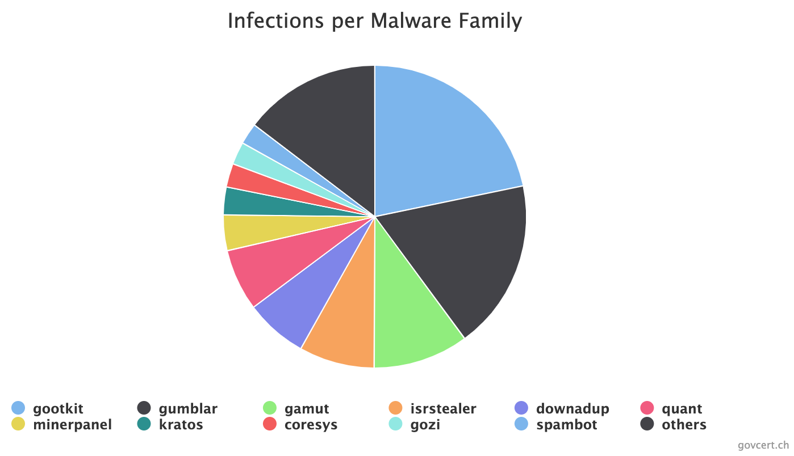
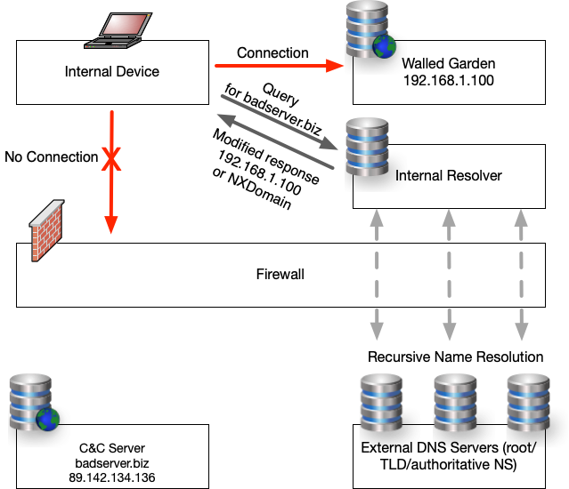
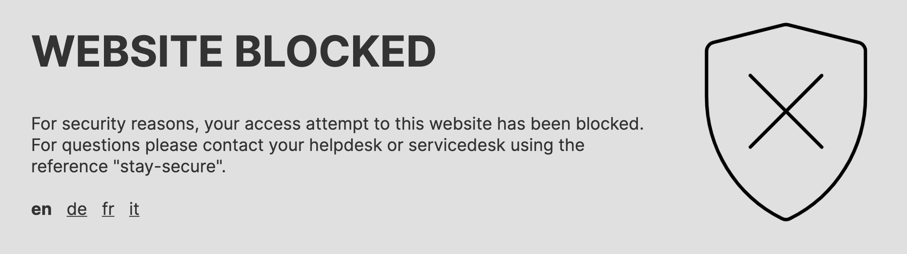

At the time of writing this blog post (October 27 2020), the Federal Office of Public Health FOPH has announced 5'949 confirmed COVID19 infections in Switzerland within the past 24 hours. After the initial COVID19 measures imposed by the federal council this spring and lifting of these in summer, the upcoming months will probably be challenging again for all of us. However, the pandemic is not only challenging for the Swiss economic and the general public but also the healthcare sector. At the same time, cyber threats are evolving targeting individuals, small and medium business but also large organizations worldwide and in all sectors. Unfortunately, hospitals were among these victims as well, as the recent events have shown: The recent ransomware attacks against Universal Health Services (UHS), the Universitätsspital Düsseldorf in Germany or Brno University Hospital in Czech Republic. NCSC has already identified this risk shortly after the COVID19 outbreak and has extended its effort to protect the general public but also the healthcare sector from cyber threats. In this blog post we would like to give you a short overview on the actions we have taken. However, it is important to outline that NCSC relies on private public partnerships (PPP) and has no legal power to force an individual or organization to participate in our efforts or impose any security measures.

## Cooperation with Internet Service Providers (ISP)

Historically, GovCERT.ch (which is part of NCSC) has a very close collaboration with participating internet service providers (ISPs) in Switzerland. In the past months, we have extended our efforts in notifying these ISPs about infected customer devices, helping them to remediate the infection with their client. We have also increased our efforts in providing them more comprehensive datasets and hence helping them to protect their clients better from cyber threats. The following chart shows the top infections we report to participating ISPs in Switzerland.

## Response Policy Zone for ISPs and Critical Infrastructures

In autumn last year, NCSC/GovCERT.ch has started distributing information about hostile domains using an RPZ which allows such to do a zone transfer of our data into their own DNS resolvers and deciding whether to block, redirect or alert clients that hit a malicious domain. The response policy zone contains information about hostile domains that are being used for phishing attacks, malware downloads (these days typically Emotet) and Command and Control server communication (C&C).  Today, 12 critical infrastructures and ISPs are using the RPZ zone transfer protecting a user base of several hundred thousand users.

## Secure DNS resolver for the healthcare sector

In May 2020, NCSC/GovCERT.ch has introduced a secure DNS resolver which is provided to organizations in the healthcare sector free of charge. The DNS resolver acts as a DNS firewall (RPZ) and provides additional protection against hostile domain names such as malware and phishing sites, but also such that are being used for botnet Command and Control (C&C). As of today, 5 hospitals and one healthcare organization are using the DNS resolver service to secure their internet access.

## What to do?

What does this mean for you?

- If you are an individual or SME, you may check with your Internet Service Provider (ISP) if and what kind of IT-security mechanisms and tools are in place to protect you from cyber threats.
- If you are a critical infrastructure, you may get in contact with us to figure how we can support you in better protecting your infrastructure.
- If you are an organization from the healthcare sector, you may get in contact with NCSC/GovCERT.ch to figure out how to we can support you during COVID19 and how to implement our secure DNS resolver.
- If you are an internet service provider (ISP), you may get in contact with us to figure out how we can help you to protect your customers from cyber threats.

Contact: outreach [at] govcert {dot} ch
