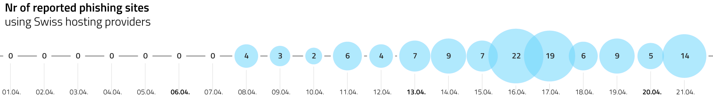

Since the beginning of April 2020, we are seeing an increase in phishing attacks against webmasters and domain owners in Switzerland. Unknown threat actors are phishing for credentials for accounts on web admin panels of at least three major hosting providers in Switzerland.

In order to gain access to these web admin panels, the perpetrator is sending out many phishing emails that pretend to come from Swiss hosting providers. In fact, they originate from hijacked email accounts abroad or from infrastructures that the perpetrator has rented at hosting providers abroad for exclusively for this purpose.

So far, we have only seen such phishing emails written in German and French. They may look like this:

<!-- ```
From: <name of hosting provider> <don@victim-domain>
Subject: Service-Aufhängung - <victim-domain>

From: <name of hosting provider> <support@domain-of-hosting-prover>
Subject: ACTION REQUISE

From: <name of hosting provider> <support@domain-of-hosting-prover>
Subject: Rappel: veuillez renouveler votre commande : 9.43 CHF
``` -->

| From                                                              | Subject                                               |
| ----------------------------------------------------------------- | ----------------------------------------------------- |
| \<name of hosting provider\> \<don@victim-domain\>                | Service-Aufhängung - \<victim-domain\>                |
| \<name of hosting provider\> \<support@domain-of-hosting-prover\> | ACTION REQUISE                                        |
| \<name of hosting provider\> \<support@domain-of-hosting-prover\> | Rappel: veuillez renouveler votre commande : 9.43 CHF |

The email body usually contains a link to a compromised website that redirects the victim to the final phishing website. This initial phishing link is usually personalised for the victim to include its domain name as well and / or the name of its hosting provider. The chart below shows the number of distinct phishing websites for the three most targeted Swiss hosting provider that Swiss citizens have reported to NCSC / GovCERT.ch on [https://www.antiphishing.ch](https://www.antiphishing.ch):

<br/>

[](assets/nrofreports.png)

<br/>

## Recommendations for users

- **Enable Two-Factor-Authentication (2FA) whenever possible**
- **Hosting Providers never ask you via email to enter credentials**
- Do not enter your credentials on websites you don’t know, use bookmarks or type out the address of the admin panel.
- Do not follow links in emails from strangers.
- If you have entered your credentials on a suspicious website, please change your password immediately and notify your hosting provider as soon as possible.
- Report suspicious emails and phishing attempts to NCSC / GovCERT.ch either:
  - Via web form: [https://www.antiphishing.ch](https://www.antiphishing.ch)
  - Via email: [reports@antiphishing.ch](mailto:reports@antiphishing.ch) (make sure that you forward the suspicious email “as an attachment” instead of just clicking the “forward” button in your email client. This will preserve the email headers, which includes the actual origin of the phishing email)

## Recommendations for hosting providers:

- **Offer Two-Factor-Authentication (2FA) on any internet facing admin panel.**
- Enforce strong passwords on the Admin Panels as well as on any Remote Access Console (VNC, etc.).
- Monitor your internet facing admin panels for suspicious behaviour. For example:
  - Is the user suddenly logging in from an unexpected geo location?
  - Is the user suddenly logging in from a VPN provider or anonymisation network (Tor) that he has never used before?
  - Is the user suddenly using a web browser / OS he has never used before?
  - Are there multiple logins from the same IP(s) for many accounts within a short time?
- Send digitally signed (S/MIME) emails and inform your customers.
- Implement SPF/DKIM/DMARC for your domains.
- Contact us (outreach@govcert.ch) in case you notice large scale phishing campaigns, breaches, or if you would like us to assist you during incident response.
- Inform your users about failed login attempts (either via email or when the user logs in the next time).
