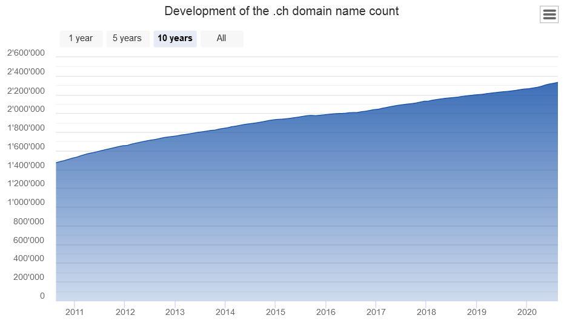
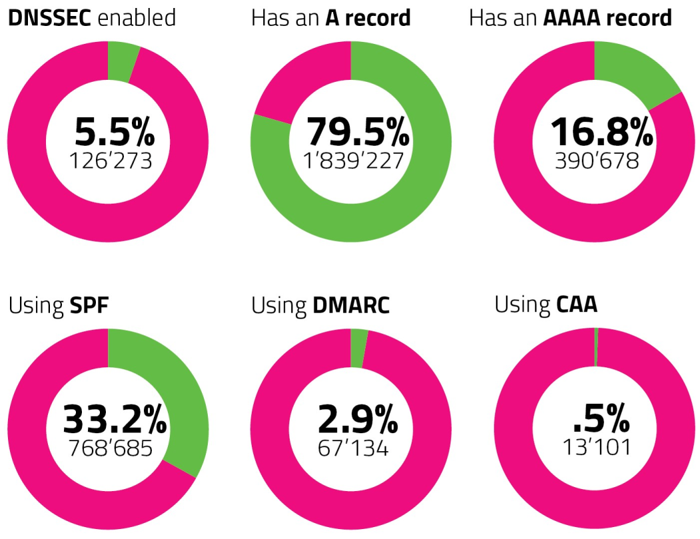

Since the introduction of the Domain Name System (DNS) in 1987 (RFC1034 / RFC1035), more than 30 years have passed. The internet became as crucial as food and power supply. Back in 1987, the inventors and engineers of DNS probably never thought that the internet would become such a big and crucial thing for the 21th century. As a result, DNS comes with a handful of weaknesses that can be exploited by threat actors for malicious purposes. In the past years, the community reacted on those threats with several enhancements to the protocol to strengthen the DNS eco system and make it more resilient against such attacks. One of those techniques are the “Domain Name System Security Extensions” (DNSSEC) that guarantees the authenticity and integrity of the DNS.

In 2015, GovCERT.ch launched a [survey](https://www.govcert.ch/blog/joining-the-dnssec-day-in-germany/) on the Swiss Top-Level-Domain (TLD) .ch that has shown that only 0.30% are using DNSSEC. In the meantime, 5 years have passed which is why we decided to launch another survey on the Swiss Top-Level-Domain (TLD) .ch. The question we want to answer is: What’s the adoption rate of security mechanisms that rely on DNS within ccTLD .ch? In our analysis, we have not only checked the adoption rate of DNSSEC for ccTLD .ch domains but also other security extensions that can be implemented on the DNS level:

| **Technology** | **Purpose** | **RFC** |
| ------------------------------------------------------------ | ------------------------------------- | ------- |
| Sender Policy Framework (SPF)| Validation of sending Mail server| RFC7208 |
| Domain-based Message Authentication, Reporting and Conformance (DMARC) | Validation of sending Mail server     | RFC7489 |
| DNS Certification Authority Authorization (CAA)     | SSL certificate issuing authorization | RFC8659 |

In a nutshell: SPF allows receiving mailservers to check if the sending mailserver is allowed to send email on behalf of a certain domain. DMARC is a combination of SPF, DKIM (Domain Keys identified Mail) and a policy on how to proceed with failures. CAA allows an organization to publish the information which Certificate Authorities (CAs) are authorized to issue certificates for the domain(s) of their organization.

To conduct our survey, we have obtained a copy of the ccTLD .ch zone from SWITCH who is the domain registry for .ch. The data contains all active delegations .ch (note: the dataset does **not** contain any information about domain owners. It **only** contains technical information required by the DNS to ensure that the domain name resolves), e.g. the authoritative name servers.

 As of 15th August 2020, more than 2’330’00 domain names have been registered. When conducting our survey, 2’313’465 where present in the zone.

*Source:* [*https://www.nic.ch/statistics/domains/*](https://www.nic.ch/statistics/domains/)

## Results

The following table shows the raw number of tested domains including the number of domain names that have a specific security feature enabled.

|                           | **Domain count** | **Percentage** |
| ------------------------- | ---------------- | -------------- |
| Domains in zone           | 2’313’465        | 100%           |
| DNSSEC enabled            | 126’273          | 5,5%           |
| Using SPF                 | 768’685          | 33,2%          |
| Using DMARC               | 67’134           | 2,9%           |
| Using CAA                 | 13’101           | 0,5%           |
| Has an A record (IPv4)    | 1’839’227        | 79,5%          |
| Has an AAAA record (IPv6) | 390’678          | 16,8%          |

Having a look at these numbers, we can make the following conclusions:

- The adoption rate of DNSSEC increased by more than 18 times from 0,30% to 5.5%, but it is still at a very low level.
- SPF, which is used for email authentication, apparently has the biggest adoption rate: every 3rd domain name is making use of it!
- DMARC, which is also used for email authentication, has an adoption rate that is 10 times less than SPF. We suspect the reason for this is the higher complexity of DMARC.
- Only 0,5% of the active .ch domains have indicated which Certificate Authorities (CAs) are allowed to issue SSL certificates for their domain, which is really a pity as it is easy to implement and provides a good protection against several attack vectors involving rogue certificates.
- While almost 80% of the domains are currently resolving to an IPv4 address, only 16,8% are supporting the Internet Protocol version 6 (IPv6) as well.

We conclude that the implementation of security mechanisms in the DNS has still a rather low adoption rate, which increases the attack surface of domain names that are not using such technologies. There might be various reasons for this:

- It is up to every domain name **registrant** (owner of a domain name) to decide which security mechanisms they want to implement for their domain name (if any).
- Some of these technologies are quite complex and hence not easy to implement, especially for users who are not IT professionals.
- The implementation may break some of the domain name’s services (or even disrupt the whole domain name) if not done properly.
- For large organizations, the implementation of such security mechanisms must be planned carefully.

## Recommendations

NCSC/GovCERT.ch believes that a broader adoption of the security mechanisms mentioned above will strengthen the resilience of .ch domains against cyber threats and manipulation. We therefore make the following recommendations:

- Implement DNSSEC to ensure the authenticity and integrity of the name resolutions of your domains.
- Implement SPF + DMARC to prevent spoofing emails from your domain names.
- If you offer a critical online service (such as eBanking, online taxes or payment services, etc): Implement CAA to ensure that only certificate authorities are able to issue certificates for your service that have been authorized by you.

## Further reading

- GovCERT.ch - Joining the DNSSEC Day in Germany:
   https://www.govcert.ch/blog/joining-the-dnssec-day-in-germany/
- RFC 7208 - Sender Policy Framework (SPF):
   https://tools.ietf.org/html/rfc7208
- RFC7489 - Domain-based Message Authentication, Reporting, and Conformance (DMARC):
   https://tools.ietf.org/html/rfc7489
- RFC8659 - DNS Certification Authority Authorization (CAA) Resource Record:
   https://tools.ietf.org/html/rfc8659
- nic.ch – DNSSEC:
   https://www.nic.ch/security/dnssec/
- Enhancing DNSSEC:
https://securityblog.switch.ch/?s=DNSSEC
