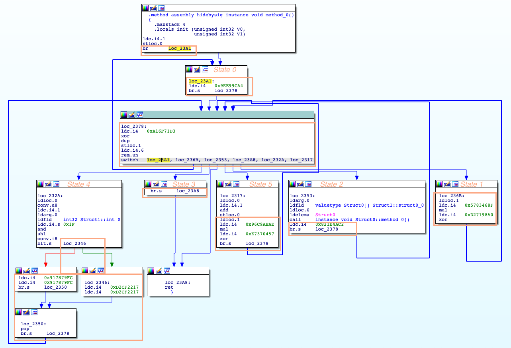

In this paper

<a href="/downloads/whitepapers/Unflattening-ConfuserEx-Code-in-IDA.pdf">Unflattening ConfuserEx .NET Code in IDA</a>

we're studying the ConfuserEx[^2] obfuscation mechanism of a Ginzo .NET sample. This class of obfuscator is known as *code flatteners*. We describe how it can dealt with it using a Python script within *IDA Pro*[^1], a famous reverse-engineering tool. 

Code flattening is not new. ConfuserEx is the probably best known implementation of it, but it is around for native x86 samples for well over ten years. There are also tools available to undo ConfuserEx code flattening[^3]; depending on the sample, several of these tools must be applied one after the other. However, it is always possible to come across new variants of such code flatteners where these tools from 2017 might fail. So we think it makes sense to understand how one can deal with this by writing our own Python scripts - it is also very interesting to look under the hood.

Code flattening transforms different flow constructs (`if-then-else`, `while`-loops, `for`-loops, etc.) into a *state machine*. State machines are software-emulations of *Turing machines*, which can in principle implement any algorithm, and are very hard to structurally understand by human researchers, as most of the original code structure is no longer obvious. Usually, only parts of functions are transformed into such a state machine. Function calling itself is not obfuscated, so functions don't disappear, and no new functions are generated. However, more than one such state machine can appear inside a single function. Also, not all code is usually obfuscated. One reason for this is that code flattening comes at a performance price, as it basically adds an additional code interpretation layer. 

A state machines consists of:
- a *state*, implemented using one or several variables, usually of `integer` type
- a *loop*, usually a `while` loop. At the *initial state*, the state variable is set to an initial value before the loop is entered, and set to a new value at every loop iteration. One state typically is the *end* state, where the loop is left. The initial state should normally not be re-iterated, but this is technically still possible, as it is also addressed in the internal `switch` statement.
- a `switch` statement as main element of the loop, taking the current state variable as input. The state variable is usually *compacted* into the actual *state value*, typically by a modulo operation, which is then mapped to a  `case`  block. This block contains some *real* code - that is code which appeared in the unobfuscated code, e.g. inside an `for` loop - and some *control* code, which calculates the new state. This calculation usually applies mathematical operations like multiplications, additions, or exclusive-OR operations with the previous state variable content as input. The state calculation is either *linear*, which means the state variable is set to one new value, or *branched*, which means the state variable is set to one of two possible values, depending on a real-code condition. This is how `if-then-else` constructs are implemented.  

The following IDA graph shows a simple example of such a state machine obfuscation - we marked the actual state values in orange (0-5, as the state variable, stored in `stloc.1`, is taken modulo 6). For each state, we also marked the control code - i.e. the code calculating the next state variable content - in orange. State 4 contains a branch (`blt.s loc_2346`), all other states are linear, state 3 is the end state, and state 0 is the initial state:

One tricky part in the  analysis is that by just studying one `case` block statically, it is impossible to find out which state will be the next one when executed dynamically. This is because the entry value of the state variable is unknown, which makes the correct calculation of the next state impossible. Only the entry state *value*, which actually appears as `case` label, is known - but this is the result of a modulo operation of the state variable and does not contain enough information to calculate the next state, because modulo is non reversible operator. E.g., the state variable typically is a 32-bit-integer, i.e. a value between 0 and ~4 billion, but the state value usually is below 100. In other words, one must know the *history* of previous states at actual execution in order to calculate the successor.

This leads to another tricky issue: states can be entered several times during dynamic execution, which is not unusual and exactly how loops are implemented. One would excpect the actual state variable content for every re-iteration of one and the same state to be the same, or at least identical compacted (modulo) state values. If this was the case, real code of one state block would be proven to appear only one time in the unobfuscated code, and we call the state machine *consistent*. This is one of the conditions for code unflattening algorithms to properly work. The good news is, all state machines in our sample are consistent. However, we can't be sure this is always the case, and we could think of pretty advanced obfuscators resulting in inconsistent state machines. For the moment we just need to be aware of this - our code detects these situations, but does not try to solve them.

While any structured element can be translated into such a state machine in a straightforward manner, the opposite is not true. This is somehow comparable with assembly instructions themselves, which need not represent structured C-code, while any structured C-code can be compiled into assembly instructions. State machine obfuscations can indeed be seen as a special types of *virtual machine obfuscations*.

As `de4dot` is a complex tool, trying to modify it for our needs seemed to be quite a complicated approach - so we decided to write our own simpler IDA Pro Python script, in the hope we can modify it for similar new situations. It traverses all code, tries to find the relevant `switch` statements, and then emulates the control code for every possible situation in an exhaustive manner. If the analysis results in a consistent state machine, the linear or branched succesor states are known for every state, and the script replaces the branches back to the loop by branches to the calculated successor states. So code is never actually relocated, just branches are rewritten. If all works, the standard .NET deompiler `dnspy` can usually figure out the original constructs and code structures become visible again. We considered applying the deobfuscator on decompiled C# code, but decided against it; it works on instruction level, and the final decompilation step follows the dobfuscator.

Source code is available on [https://github.com/govcert-ch/ConfuserEx_IDAPython/](https://github.com/govcert-ch/ConfuserEx_IDAPython/).

[^1]:  see [https://hex-rays.com/](https://hex-rays.com/) 
[^2]:  see [https://mkaring.github.io/ConfuserEx/](https://mkaring.github.io/ConfuserEx/) and [https://github.com/yck1509/ConfuserEx](https://github.com/yck1509/ConfuserEx)
[^3]:  see [https://github.com/de4dot/de4dot](https://github.com/de4dot/de4dot) and [https://github.com/VAllens/ConfuserExSwitchKiller](https://github.com/VAllens/ConfuserExSwitchKiller)

